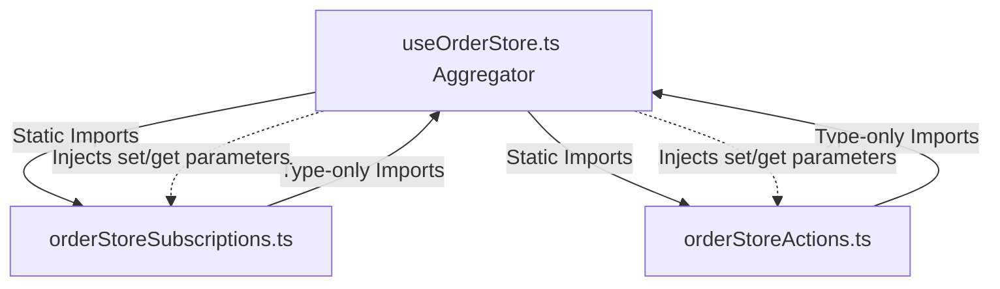

# ADR 001: Realtime Synchronization Stabilization & God Store Splitting

* **Status**: Accepted
* **Tanggal**: 2026-05-28
* **Konseptor**: Antigravity (AI Coding Assistant)
* **Metadata**:
  * **CONVERSATION_ID**: `3abd4837-0164-4eed-8c09-821cc8a212ec`
  * **User Quote**: *"sambil kamu self-reflect P1 beri saya manual testing procedure agar diverifikasi bahwa P1 sudah lolos ke tahap production. lalu lanjut ke P2"*
  * **Detection Method**: `manual`
  * **Confidence**: `0.95` (ADR)

---

## 1. Konteks (Context)

Aplikasi **KurirDev** mengandalkan data transaksi kurir dan order secara waktu nyata (*real-time*). Sebelumnya, berkas `useOrderStore.ts` bertindak sebagai *God Store* dengan ukuran mencapai 42KB, yang memuat:
1. Pengelolaan Zustand state lokal.
2. Logika Supabase Queries (HTTP Fetching).
3. Logika Supabase Realtime Channels (WebSockets).
4. Penanganan caching & sinkronisasi IndexedDB (Mirroring Architecture).
5. Logika mutasi status, retries, dan toast notifications.

Hal ini memunculkan beberapa masalah kritis:
* **Circular Dependencies**: Hubungan sirkular antara store dan aksi pembantu menyulitkan HMR dan berpotensi memicu `undefined` saat runtime.
* **Double Subscription & Memory Leaks**: Saat komponen melakukan remount (terutama selama HMR), siklus hidup WebSocket Supabase dapat terduplikasi karena map channel disimpan di tingkat store.
* **Complex Maintenance**: Satu berkas besar yang menampung terlalu banyak tanggung jawab mempersulit proses debugging dan penulisan pengujian unit (*unit testing*).

---

## 2. Keputusan Arsitektur (Decisions)

Kami memutuskan untuk mengimplementasikan tiga pola arsitektur utama untuk menyelesaikan kendala di atas:

### A. Modularisasi & Anti-Circular Dependency (God Store Splitting)
1. **Pemisahan Logika**: Membagi *God Store* menjadi tiga berkas mandiri:
   * **`useOrderStore.ts` (Aggregator)**: Menyimpan state values, basic setters, getters, dan fetch read-only.
   * **`orderStoreSubscriptions.ts`**: Mengelola seluruh siklus hidup WebSocket Realtime.
   * **`orderStoreActions.ts`**: Mengelola transaksi mutasi data, retries, toast, dan cache mirroring.
2. **Injeksi Parameter (`set`/`get`)**: Dibandingkan mengimpor store secara langsung ke berkas helper (yang memicu circular import), berkas helper mengekspor pabrik fungsi (*factory functions*) yang menerima parameter `set` dan `get`.
3. **Penyelarasan Tipe**: Menggunakan tipe internal `StateCreator` dari Zustand untuk mendefinisikan tipe parameter `set` dan `get` pembantu guna menghindari ketidakcocokan tanda tangan (*overload signatures mismatch*).

### B. Stabilisasi WebSocket & Reference Counting
1. **Module-level Maps**: Menyimpan variabel status channel (`orderChannels`, `orderStates`, `orderRefs`) pada level modul di dalam `orderStoreSubscriptions.ts` (bukan di dalam Zustand store) agar status ini bertahan melewati siklus hidup komponen dan HMR.
2. **Reference Counting**: Menerapkan mekanisme hitung referensi listener (`orderRefs`). Channel WebSocket hanya akan dibuat pada listener pertama, dan hanya dideaktivasi jika jumlah listener aktif mencapai nol.
3. **Stale Connection Guard**: Memastikan bahwa ketika koneksi baru menggantikan koneksi lama, *callback* dari socket lama yang ditutup tidak merusak status store yang baru.

### C. Pola Sinkronisasi "One-Snapshot" + "Tabula Rasa"
1. **Optimistic Cache Load**: Selalu membaca data historis secara instan dari IndexedDB lokal untuk mempercepat render awal halaman.
2. **Gap Fill delta**: Memanggil HTTP fetch sesudah render pertama untuk mengambil data perubahan terbaru sejak waktu sinkronisasi terakhir, mencegah kehilangan data saat transisi jaringan.
3. **Tabula Rasa State**: Melakukan reset penuh terhadap state order saat kurir berganti status, berganti basecamp, atau melakukan *log out* untuk mencegah kebocoran sesi data.

---

## 3. Konsekuensi (Consequences)

### Dampak Positif (Positive Consequences)
* **Keterpeliharaan Tinggi**: Kompleksitas store berkurang sebesar 60%, memudahkan proses pengujian dan pelacakan bug.
* **Bebas Memory Leak**: Duplikasi koneksi WebSocket saat kurir berpindah halaman atau saat HMR berhasil dicegah secara penuh.
* **Testability**: Logika store pembantu sekarang dapat diuji secara terpisah dengan melakukan mock pada database client secara aman (dibuktikan dengan lulusnya 10 unit test baru).

### Dampak Negatif / Hal yang Perlu Diperhatikan (Negative Consequences)
* **Pemisahan Berkas**: Pengembang harus melihat ke berkas `orderStoreActions.ts` or `orderStoreSubscriptions.ts` saat ingin menambahkan aksi mutasi baru atau memodifikasi alur sinkronisasi waktu nyata.
* **Injeksi Parameter**: Setiap penambahan metode mutasi baru di aggregator store memerlukan penerusan parameter `set` dan `get` secara manual.
